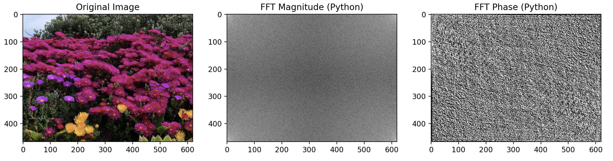
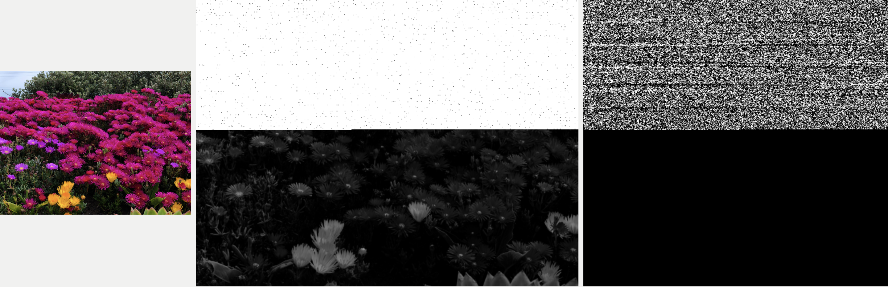

# FFT Documentation
There is discrepancy between python's np.fft.fft2 function and swift's performFFT function. Same image and array of numbers with width and height are used for both functions. Their inputs and outputs are displayed individually below. Recommend running swift files, img.playground and int.playground, individually in Xcode and python files, python_img_fft.py and python_int_fft.py, in VSCode. Python files will show results immediately, however, for img.playground, results after FFT will be saved to a folder. 

## Python FFT function
python_img_fft.py file is to perform np.fft.fft2 function on an image. With the input of the image on the left, np.fft.fft2 is performed to output middle and right images which are fast fourier transform's magnitude and phase.


In python_int_fft.py file, np.fft.ftt2 function is performed with input of image_pixels, width, height. After converting given input of image_pixels, which are list of integers, to 2D numpy array, it performs fast fourier transform using np.fft.fft2 function. Real and imaginary parts are extracted from the fft result and shown below. 
### Input:
```
   1    2    3    4    5    6    7    8    9   10
  11   12   13   14   15   16   17   18   19   20
  21   22   23   24   25   26   27   28   29   30
  31   32   33   34   35   36   37   38   39   40
  41   42   43   44   45   46   47   48   49   50
  51   52   53   54   55   56   57   58   59   60
  61   62   63   64   65   66   67   68   69   70
  71   72   73   74   75   76   77   78   79   80
  81   82   83   84   85   86   87   88   89   90
  91   92   93   94   95   96   97   98   99  100
```

### Output-Real Part:
```
  5050.00    -50.00    -50.00    -50.00    -50.00    -50.00    -50.00    -50.00    -50.00    -50.00
  -500.00      0.00      0.00      0.00      0.00      0.00      0.00      0.00      0.00      0.00
  -500.00      0.00      0.00      0.00      0.00      0.00      0.00      0.00      0.00      0.00
  -500.00      0.00      0.00      0.00     -0.00      0.00     -0.00      0.00      0.00      0.00
  -500.00      0.00      0.00      0.00      0.00      0.00      0.00      0.00      0.00      0.00
  -500.00      0.00      0.00      0.00      0.00      0.00      0.00      0.00      0.00      0.00
  -500.00      0.00      0.00      0.00      0.00      0.00      0.00      0.00      0.00      0.00
  -500.00      0.00      0.00      0.00     -0.00      0.00     -0.00      0.00      0.00      0.00
  -500.00      0.00      0.00      0.00      0.00      0.00      0.00      0.00      0.00      0.00
  -500.00      0.00      0.00      0.00      0.00      0.00      0.00      0.00      0.00      0.00
```

### Output-Imaginary Part:
```
     0.00    153.88     68.82     36.33     16.25     -0.00    -16.25    -36.33    -68.82   -153.88
  1538.84      0.00      0.00      0.00     -0.00      0.00     -0.00      0.00      0.00      0.00
   688.19      0.00      0.00      0.00     -0.00      0.00     -0.00      0.00      0.00     -0.00
   363.27      0.00      0.00      0.00      0.00      0.00      0.00      0.00      0.00      0.00
   162.46      0.00      0.00      0.00     -0.00      0.00     -0.00      0.00     -0.00     -0.00
    -0.00      0.00      0.00      0.00      0.00      0.00      0.00      0.00      0.00      0.00
  -162.46      0.00      0.00      0.00      0.00      0.00      0.00      0.00     -0.00     -0.00
  -363.27      0.00      0.00      0.00     -0.00      0.00     -0.00      0.00      0.00      0.00
  -688.19      0.00      0.00      0.00      0.00      0.00      0.00      0.00      0.00     -0.00
 -1538.84      0.00      0.00      0.00      0.00      0.00      0.00      0.00      0.00      0.00
```

## Swift FFT function
swift_img_fft.swift file is to run performFFT function on an image. With the input of the image on the left, it gets converted to grayscale. Then performFFT function is performed on the grayscale image to output middle and right images which are fast fourier transform's magnitude and phase. Swift's performFFT function is based on vDSP_fft2d_zip. 


In swift_int_fft.swift file, performFFT function is performed with input of serialImagePixels, width, and height. For serialImagePixels, list of floats that represent image pixels, fast fourier transform is performed with performFFT function 
to output real and imaginary parts which are shown below.
### Input:
```
   1.00    2.00    3.00    4.00    5.00    6.00    7.00    8.00    9.00   10.00
  11.00   12.00   13.00   14.00   15.00   16.00   17.00   18.00   19.00   20.00
  21.00   22.00   23.00   24.00   25.00   26.00   27.00   28.00   29.00   30.00
  31.00   32.00   33.00   34.00   35.00   36.00   37.00   38.00   39.00   40.00
  41.00   42.00   43.00   44.00   45.00   46.00   47.00   48.00   49.00   50.00
  51.00   52.00   53.00   54.00   55.00   56.00   57.00   58.00   59.00   60.00
  61.00   62.00   63.00   64.00   65.00   66.00   67.00   68.00   69.00   70.00
  71.00   72.00   73.00   74.00   75.00   76.00   77.00   78.00   79.00   80.00
  81.00   82.00   83.00   84.00   85.00   86.00   87.00   88.00   89.00   90.00
  91.00   92.00   93.00   94.00   95.00   96.00   97.00   98.00   99.00  100.00
```

### Output-Real Part:
```
 2080.00   -32.00   -32.00   -32.00   -32.00   -32.00   -32.00   -32.00  -256.00     0.00
    0.00     0.00     0.00     0.00     0.00     0.00  -256.00     0.00     0.00     0.00
    0.00     0.00     0.00     0.00  -256.00     0.00     0.00     0.00     0.00     0.00
    0.00     0.00  -256.00     0.00     0.00     0.00     0.00     0.00     0.00     0.00
 -256.00     0.00     0.00     0.00     0.00     0.00     0.00     0.00  -256.00     0.00
    0.00     0.00     0.00     0.00     0.00     0.00  -256.00     0.00     0.00     0.00
    0.00     0.00     0.00     0.00    65.00    66.00    67.00    68.00    69.00    70.00
   71.00    72.00    73.00    74.00    75.00    76.00    77.00    78.00    79.00    80.00
   81.00    82.00    83.00    84.00    85.00    86.00    87.00    88.00    89.00    90.00
   91.00    92.00    93.00    94.00    95.00    96.00    97.00    98.00    99.00   100.00
```

### Output-Imaginary Part:
```
   0.00   77.25   32.00   13.25    0.00  -13.25  -32.00  -77.25  618.04    0.00
   0.00    0.00    0.00    0.00    0.00    0.00  256.00    0.00    0.00    0.00
   0.00    0.00    0.00    0.00  106.04    0.00    0.00    0.00    0.00    0.00
   0.00    0.00    0.00    0.00    0.00    0.00    0.00    0.00    0.00    0.00
-106.04    0.00    0.00    0.00    0.00    0.00    0.00    0.00 -256.00    0.00
   0.00    0.00    0.00    0.00    0.00    0.00 -618.04    0.00    0.00    0.00
   0.00    0.00    0.00    0.00    0.00    0.00    0.00    0.00    0.00    0.00
   0.00    0.00    0.00    0.00    0.00    0.00    0.00    0.00    0.00    0.00
   0.00    0.00    0.00    0.00    0.00    0.00    0.00    0.00    0.00    0.00
   0.00    0.00    0.00    0.00    0.00    0.00    0.00    0.00    0.00    0.00
```


